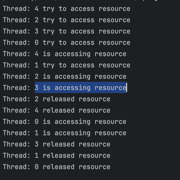

## synchronized

> 동기화
> - 멀티 스레드, 멀티 프로세스 환경에서 공유 및 수정이 가능한 자원을 다룰 때, 자원의 안정성, 신뢰성 보장을 위해 접근 가능한 공동 자원의 싱크를 맞춰주는 작업 

> - 대표적인 메커니즘 
>   - 상호 배제 (mutual exclusive), 하나의 스레드가 임계 영역에서 실행 중일 때는 다른 스레드가 임계 영역에 들어갈 수 없음. 
>   - 상호 배제 달성을 위한 기본적인 두가지 기법 : [Mutex, semaphore]

> 동시성 프로그래밍의 가장 큰 숙제 : 공유자원 관리

#### Mutex
> - 화장실 열쇠가 하나뿐인 카페에서 열쇠를 가진 사람만 화장실 사용 가능(+ lock 풀기 가능), 다른 사람들은 열쇠가 반납될 때까지 대기
> - 사람 [프로세스, 쓰레드], 화장실 [공유 자원], 키[공유 자원 접근을 위한 오브젝트]
> - key 에 해당하는 오브젝트가 존재하는 이 오브젝트를 소유해야만 접근이 가능함

> 스레드 5개로 하나의 공유자원에 접근하는 mutex test 실행 결과
>> 

#### Semaphore
> - 화장실 여러 칸이 있는 레스토랑에서 입구의 전광판이 빈 칸 개수를 표시, 빈 칸이 1개 이상일 때만 입장 가능 (입장 시 -1, 퇴장 시 +1), 모든 칸이 찬 경우(값이 0) 빈 칸이 생길 때까지 대기
> - 사람 [프로세스, 쓰레드], 화장실 칸 [공유 자원] ,전광판 숫자 [현재 사용 가능한 자원의 개수]
> - lock 을 걸지 않은 스레드도 시그널을 보내 lock 해제 가능

> 스레드 5개로 3개의 공유자원에 접근하는 semaphore test 실행 결과
> 

